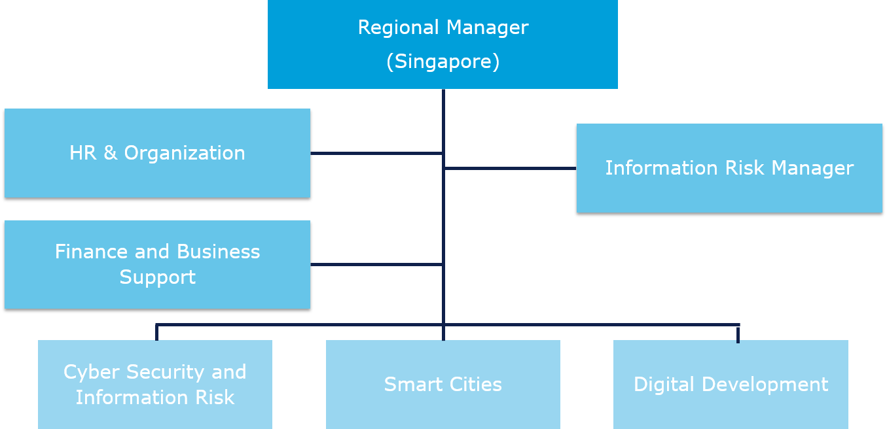
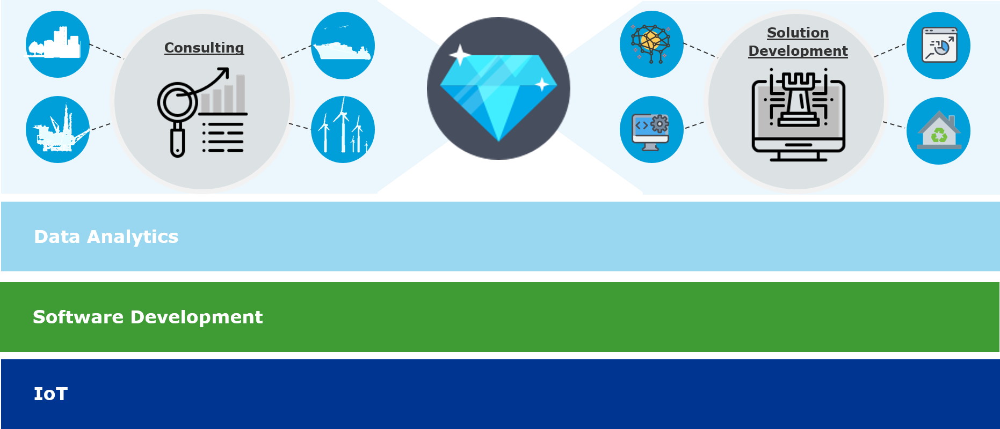

### What is DNV GL and Digital Solutions?

Digital Solutions is a leading and trusted provider of digital solutions, data analytics and platform services. 

We are recognized for helping our customers to succeed through digitalization and to manage business critical activities in a safe, responsible, and cost efficient manner. 
Digital solutions will strengthen the impact of DNV GL and establish new growth positions. 

To see more information about DNVGL, please visit [__here__](https://www.dnvgl.sg/). 

### What is DNV GL Digital Hub Singapore? 

Digital Hub Singapore is DNV GL's new technology hub. They are Digital Development, Smart Cities and Cyber Security teams – including support for DNV GL’s open industry platform Veracity. 

The digital hub, part of DNV GL – Digital Solutions, is set up to work closely with local and regional authorities and industry players to improve the performance of assets and infrastructure and to increase quality of life.

To see more information about Digital Hub Singapore, please visit [__here__](https://www.dnvgl.com/news/dnv-gl-launches-digital-hub-in-singapore-124295). 

 

 
[Organization view of Digital Solutions Singapore] 

#### Focus Area

DNV GL is focusing on the power of digitalization combined with expertise and experience in operational technology and information technology to meet increasing expectations regarding asset performance and living conditions. 

DNV GL's offerings will help cities and their various industries develop and cope with stressors and expected and unexpected change through advisory services, predictive analytics, applications development and standard setting for digital technologies. 
Some examples of the service offerings of the hub are Infrastructure Performance, Cyber Security and Climate Resilience.

#### Our Competence

DNV GL has deep and skillful know-hows and experiences in operational technologies in Maritime, Energy, Oil & Gas and Smart City industries for about 150 years. 

And by adding information technology based on our team members' strengths regarding Software Development, Data Analytics and Internet of Things (IoT), we provide the best consulting service and digital solution applications. 

 

 
[Competence of Digital Hub Singpaore - Digital Solutions Singapore] 

