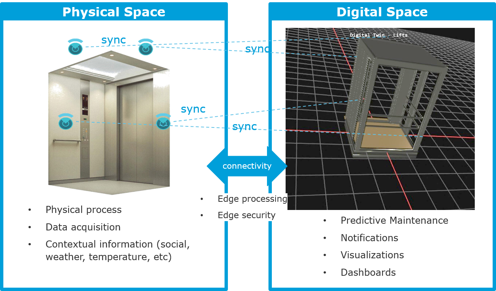
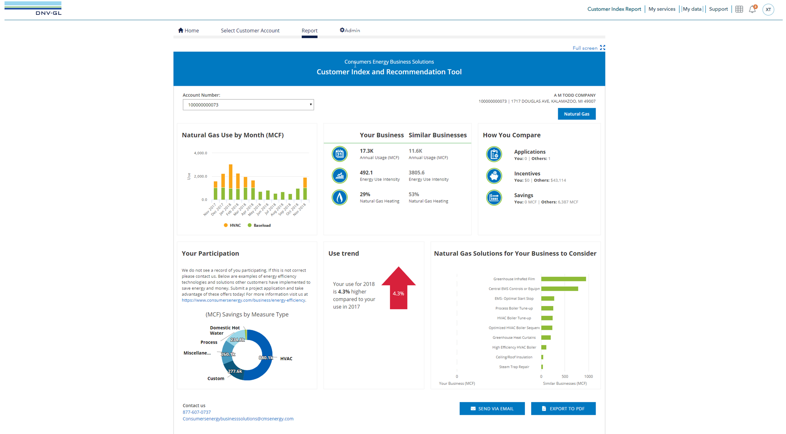
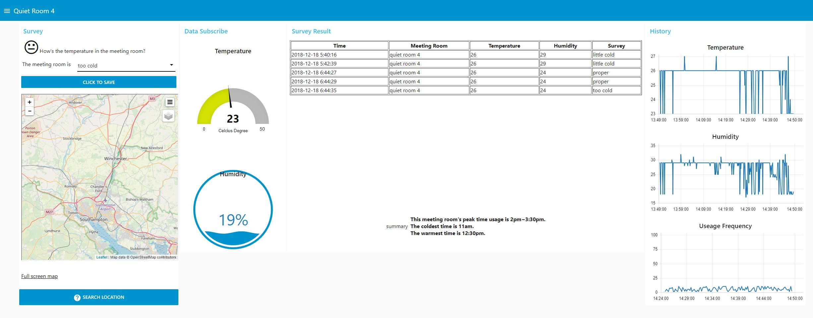

### Smart Lift

Digital Solutions Development team has implemented a smart building management system. The key technology of the project is deployment of IoT sensors on the lift and gather the data from it in real time. The data is analyzed to predict the lift failure and optimize the maintenance. 

You can see some parts of digitalized dashboard and a conceptual digital twin technology with automatic alarming for maintenance. You can see the simulated 13 elevators in 3D in below link and it is synchronized with the dashboard in real time. 

- [__Lift 3D simulation__ (if it is not opend properly, please check the insecure content blocker.)](https://dnvgl-sg.github.io/digitalhub/pages/lift3d)

 
<video id="lift-digitaltwin" class="video-js vjs-default-skin" controls
preload="auto" width="683" height="384" poster="assets/themes/dnvgl/img/lift_digitaltwin.JPG"
data-setup="{}">
<source src="assets/themes/dnvgl/img/DigitalTwin_Lift.mp4" type='video/mp4'>
</video>

 
[Smart Lift - Digital Twin Dashboard] 

The allocated sensors on the infrastructure, in this case, elevators, are linked with the simulation and will provide the more intuitive visualized dashboard in real time. Digital twin technology will offer you the optimization of operability, manufacturability and sustainability of your infrastructure by operating it in a digital space with almost unlimited number of test cases. It supports continuous refinement of designs and models before deployment in the physical space with the assessment of a system's current and future capabilities.

 

 
[Smart Lift - Digital Twin Concept] 

### Customer Index Report
CIR solution provides motivating information to customers to get them to complete more energy savings projects. 
By helping customer:
- Understand how they compare to similar customers
- What their consumption tells us about potential savings opportunities
- What similar customers have completed that might be related capital measure/technologies they should consider adopting

All the data is visulized through a very nice dashboard, see following.

 

 
[Customer Index Report - Dashboard] 

[//]: <> (### Sedimentation)
[//]: <> (Text and videos)

[//]: <> (### Zero Emission Tool)
[//]: <> (Text and videos)

### Building Management

Digital Solutions Development team is also doing some innovative projects internally, and one is a monitoring system of meeting rooms usage and environment in DNV GL Singapore building. By deploying temperature, humidity and proximity sensors in each meeting room, the employees and the building managers can see the status of the meeting rooms in real time.  

 

 
[Building Management - Meeting Room Monitoring Dashboard] 

This project is still ongoing, and it will be synched with the legacy building management system. Additional functions will be developed soon and it will ease to customize the office environment, according to the users' survey results and elaborate the building management system in energy saving perspective.