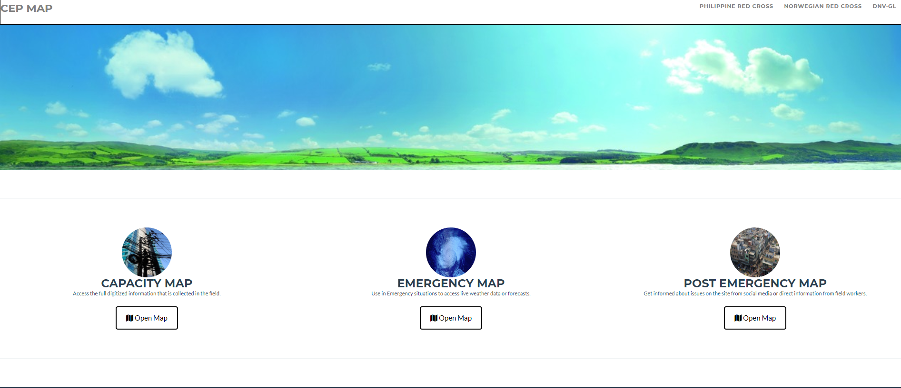

# Smart City
Urbanization is increasing world-wide and it also bring challenges:
- By 2050 cities will accommodate about 66% percent of the world’s population
- In 2012 cities occupied only about 3% of the global land area
- In 2012 cities consumed about 75% of natural resources
- In 2012 cities produced 60%-80% of all greenhouse gas (GHG) emissions

In order to address the above challenges, new and efficient ways have to be found for city operation.

In order to be more efficient to operate city, we need to rely on digital way to have better insight of infrastructure status, automate operation to replace repetitive human work, take better action based on historical data, optimize infrastructure efficiency, etc.

### Infrastructure Efficiency
We see aging infrastructures in the cities. In order to address the pressure from urbanization, there is need to extend the life cycle of infrastructure. 
Energy consumption is also a big challenge for cities with increasing population, how to reduce the energy consumption is a big topic.

To maintenance the infrastructure also requires a lot of effort, we need to find a way to reduce the operational cost. 
And how to improve the efficiency of infrastructures like electric grid, ports, transportation systems will be important for big cities.

Digital hub Singapore completes projects for smart lift, energy consumption dashboard, smart port. These solutions are reusable and generic. 
You can find more details from the showcase tab.

### **Climate Resilience**
Cities of today are driven by the megatrends of urbanization, population growth, digitalization and climate change. As a consequence, cities face major challenges of increased concentration, congestion, pollution and vulnerability, while at the same time, thriving to accommodate citizens and their needs. As such, the successful cities of tomorrow need to provide accessibility, reliability, efficiency, safety, security and sustainability. At the same time, cities are vulnerable to natural disasters, affecting hundreds of millions of people every year – resulting in serious disruptions of a functioning community or society. With this in mind, DNV GL has developed digital platform solutions, providing risk management preparedness to extreme weather events and climate change.

 

 
[Climate change effects city's functionality] 

DNV GL’s CEP MAP (Capacity, Emergency, and Post-Emergency Management and Preparedness) is an integrated, data-led risk management and preparedness system, designed to support risk and emergency management personnel through emergency planning and preparedness, response and recovery.  

 
<a href= "http://dnvgl-research.maps.arcgis.com/home/index.html"> "
</a>

 
[Capacity Emergency and Post-emergency Map] 

The tool places special emphasis on the use of data during pre- and post-disaster management, such as during early warning, hazard and vulnerability assessment and damage evaluation, as well as in deciding upon appropriate risk-reduction measures. 
With the focus on climatic and weather impacts, DNV GL has also developed an enhanced data analytics platform “C-GEAR core” (Climatic Geo Enhanced Assessment of Risks), allowing to monitor and collect information from the environment under stress and provide assessment of the risks. The C-GEAR core functionalities offer customized, tailored-made solutions, providing better understanding of what is happening (discovery), what can happen (predictive analytics and modelling) and action to be taken (from measurement to management and better decision support). 
Driven by the purpose of safeguarding life, property, and the environment, DNV GL has a history of over 150 years, providing advancing solutions for safety and sustainability. Passionate about furthering knowledge, developing insights and innovative thinking, DNV GL is continuously investing in research and development. With experts in almost 100 countries and 300 offices, DNV GL operates across five business areas such as Maritime, Oil&Gas, Energy, Business Assurance and Digital Solutions. We provide software and data platforms for managing risk, improving safety and performance. With the provision of CEP MAP and C-GEAR core tools, DNV GL aims to make the customers more productive, more aware and more responsive.

### Cyber Security
The content is under development. Contact us if you have interests.